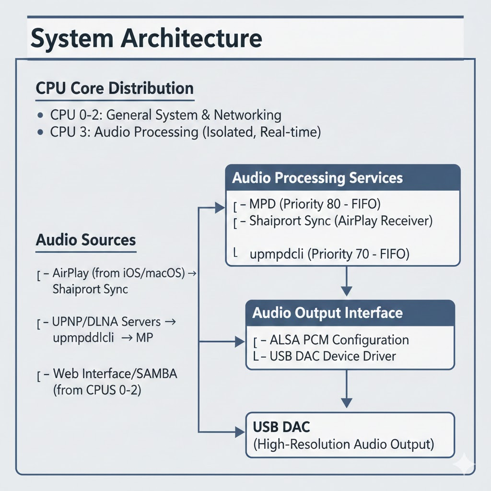

# meta-aurispi

A Yocto/OpenEmbedded BSP layer for building Auris, a high-resolution audio streaming platform.

## Overview

Auris is a dedicated music platform designed to deliver pristine high-resolution audio playback through USB DAC (Digital-to-Analog Converter) devices. The platform provides a web-based interface for managing and streaming your music collection from multiple sources.

## Features

- **High-Resolution Audio Support**: Native playback of Hi-Res audio formats through USB DAC
- **AirPlay Support**: Stream audio from iOS, macOS, and iTunes via Shairport Sync with automatic switching
- **UPnP Renderer**: Act as UPnP/DLNA audio renderer to receive audio streams from UPnP control points
- **Multiple Audio Sources**:
  - AirPlay (from iOS/macOS devices)
  - SAMBA/CIFS network shares
  - USB storage devices
  - UPnP/DLNA media servers
- **Bit-Perfect Audio**: Direct hardware access with no sample rate conversion
- **CPU Isolation**: Dedicated CPU core (CPU 3) for audio processing with real-time scheduling
  - MPD (Music Player Daemon): FIFO priority 80
  - upmpdcli (UPnP Renderer): FIFO priority 70
- **Automatic Audio Source Switching**: Seamlessly switches between audio sources when AirPlay connects
- **Web-Based Control**: Intuitive web interface for music library management and playback control
- **Optimized for Audio**: Minimal Linux image focused on audio performance
- **Raspberry Pi Ready**: Built and optimized for Raspberry Pi 5 hardware

## Image

The layer provides `auris-image`, a custom Linux image based on `core-image-minimal` with audio streaming capabilities.

## Architecture



### Automatic Audio Source Switching

The platform automatically switches between audio sources:
- When AirPlay connection is detected, Shairport Sync automatically stops MPD and upmpdcli
- When AirPlay disconnects, MPD and upmpdcli automatically resume
- This ensures seamless audio playback without manual intervention

The CPU core 3 is isolated for audio processing with real-time scheduling to ensure consistent, low-latency audio streaming for bit-perfect playback.

## Dependencies

This layer depends on:

```
URI: https://git.openembedded.org/bitbake
    branch: master
    revision: HEAD

URI: https://git.openembedded.org/openembedded-core
    branch: master
    revision: HEAD

URI: https://git.yoctoproject.org/meta-yocto
    branch: master
    revision: HEAD

URI: https://git.yoctoproject.org/meta-raspberrypi
    branch: master
    revision: HEAD

URI: https://git.openembedded.org/meta-openembedded
    branch: master
    revision: HEAD
    layers: meta-oe, meta-python, meta-multimedia
```

## Quick Start

1. Clone required layers:
   ```bash
   git clone https://git.openembedded.org/openembedded-core
   git clone https://git.yoctoproject.org/meta-yocto
   git clone https://git.yoctoproject.org/meta-raspberrypi
   git clone https://git.openembedded.org/meta-openembedded
   git clone <meta-aurispi-repository>
   ```

2. Initialize build environment:
   ```bash
   source openembedded-core/oe-init-build-env auris-build
   ```

3. Add layers to `conf/bblayers.conf`:
   - meta-aurispi
   - meta-openembedded/meta-oe
   - meta-openembedded/meta-python
   - meta-openembedded/meta-multimedia

4. Configure `conf/local.conf`:
   ```
   MACHINE = "raspberrypi5"
   LICENSE_FLAGS_ACCEPTED = "synaptics-killswitch"
   ```

   Optional: Enable SSH login for remote access and debugging:
   ```
   EXTRA_IMAGE_FEATURES:append = " ssh-server-dropbear allow-empty-password empty-root-password allow-root-login"
   ```

5. Build the image:
   ```bash
   bitbake auris-image
   ```

6. Use bmaptool to copy the generated `.wic.bz2` file to the SD card:
   ```bash
   bmaptool copy tmp/deploy/images/raspberrypi5/auris-image-raspberrypi5.wic.bz2 /dev/sdX
   ```

7. Boot your RPI

## Hardware Requirements

### Minimum Requirements
- Raspberry Pi 5
- 16GB+ microSD card
- USB DAC device
- Network connection (Ethernet or WiFi)

### Recommended Requirements
- Raspberry Pi 5 (8GB RAM)
- 32GB+ microSD card (Class 10/UHS-1 or better)
- High-quality USB DAC
- Gigabit Ethernet connection
- External USB storage for local library

## Usage

### Accessing Web Interface

After booting the Auris image:

1. Connect to the device's IP address via web browser
2. Default URL: `http://auris.local` or `http://<device-ip>`

### Adding Music Sources

#### SAMBA/CIFS Share
1. Navigate to Settings → Sources
2. Add network share with credentials
3. Browse and index your music library

#### USB Storage
1. Insert USB drive with music files
2. Device will auto-detect and mount
3. Library appears in web interface

#### UPnP/DLNA Server
1. Ensure UPnP server is on same network
2. Device auto-discovers UPnP sources
3. Select server from available sources

### Using AirPlay

Stream audio directly from your iOS, macOS, or iTunes device:

1. Ensure the device is on the same network as the Auris system
2. On your Apple device, open the AirPlay menu:
   - **iOS/iPadOS**: Control Center → Music playback card → AirPlay icon
   - **macOS**: Click the volume icon in the menu bar → AirPlay
   - **iTunes**: Click the AirPlay icon in the lower right
3. Select "Auris Audio" from the available AirPlay devices
4. Start playing audio - it will stream directly to the USB DAC

**Note**: When AirPlay is active, MPD and UPnP services are automatically paused. They will resume when you disconnect from AirPlay.

### Connecting USB DAC

1. Connect USB DAC to Raspberry Pi
2. Device automatically detects and configures DAC
3. Select DAC from audio output settings
4. Start playback

## Supported Audio Formats

- FLAC (up to 24-bit/192kHz)
- WAV (PCM)
- AIFF
- ALAC (Apple Lossless)
- DSD (DSF/DFF)
- MP3, AAC (for compatibility)

## Development

### System Performance Tuning

The Auris platform implements several performance optimizations:

#### CPU Isolation
- **Kernel Parameter**: `isolcpus=3 nohz_full=3 rcu_nocbs=3`
  - Isolates CPU 3 from system scheduler
  - Disables kernel timer interrupts on CPU 3
  - Redirects RCU callbacks to other CPUs
  - Located in: `recipes-bsp/bootfiles/rpi-cmdline.bbappend`

#### Real-Time Process Scheduling
- **MPD**: `chrt -f 80` (FIFO priority 80) - Music Player Daemon for local playback
- **Shairport Sync**: AirPlay audio receiver (standard priority)
- **upmpdcli**: `chrt -f 70` (FIFO priority 70) - UPnP/DLNA protocol handler
- Process CPU affinity via `taskset -c 3` - MPD and upmpdcli bound to isolated CPU core 3

#### CPU Governor
- Set to "performance" to minimize frequency scaling latency
- Applied via `cpu-performance.service`

#### ALSA Configuration
- Mixer disabled for direct hardware access
- Zero-copy audio buffer management
- Located in: `recipes-multimedia/alsa/alsa-config/asound.conf`

### Adding Custom Recipes

Place custom recipes in appropriate subdirectories:
```
meta-aurispi/
├── recipes-auris/
│   ├── audio-player/
│   ├── web-interface/
│   └── source-handlers/
├── recipes-core/
│   └── images/
└── conf/
```

### Contributing

Contributions are welcome! Please follow these guidelines:
- Use clear commit messages
- Test builds before submitting
- Document new features
- Follow Yocto/OE coding standards

## License

This layer is licensed under the MIT License. See `COPYING.MIT` for details.

## Support

For issues and feature requests, please use the issue tracker.

## Roadmap

- [ ] Spotify Connect integration
- [ ] Tidal/Qobuz streaming support
- [ ] Multi-room audio synchronization
- [ ] DSP effects and equalizer
- [ ] Bluetooth audio output
- [ ] Mobile app control
- [ ] Gapless playback
- [ ] Playlist management
- [ ] Album art display

## Acknowledgments

Built with:
- [Yocto Project](https://www.yoctoproject.org/)
- [OpenEmbedded](https://www.openembedded.org/)
- [Raspberry Pi](https://www.raspberrypi.org/)
